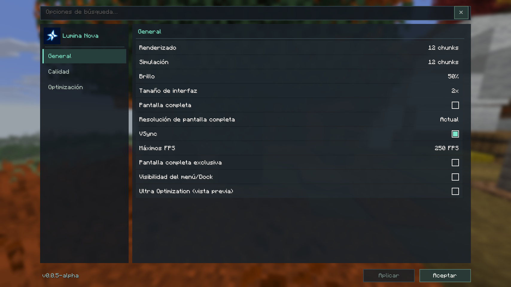

# Validación de 0.0.5-alpha

Fecha: 2026-10-10. Minecraft Java 26.3, Fabric Loader 0.19.5, JDK Temurin 25.0.3.
Esta pre-release introduce una candidata **experimental, desactivada por defecto**. La meta
3×–5× no se puede prometer para cualquier mundo o combinación de mods.

## Cambios y regresiones corregidas

- Menú centrado, filas y controles uniformes, tres páginas, búsqueda y logo completo. Aplicar
  conserva el guardado y los callbacks reales; Escape descarta lo pendiente. El botón × limpia la búsqueda.
- El crash instalado de 0.0.4 con Sodium era `IdentifierException` al registrar
  `luminanova:options.renderDistance`. Los IDs nuevos usan minúsculas con `Locale.ROOT`.
  La prueba empaquetada activa la validación de producción que no existía en el smoke de desarrollo.
- Corregido el cierre del mundo local: el radio ampliado podía enviar prioridad 52 a una cola de 46.
  La capacidad ahora conserva el margen de generación y los 18 niveles adicionales para 50 chunks.
- La candidata omite extracción/modelos de cofres, shulkers y vasijas vanilla fuera de cámara;
  también omite cofres simples cerrados completamente rodeados de bloques opacos.
  Conserva renderizadores personalizados, overlays de rotura, tapas abiertas, cofres dobles,
  efectos fuera del bloque y cámara dentro de la celda. No cambia ticks, distancias ni calidad.
- Con Entity Culling, More Culling, Iris o VulkanMod no se instala el mixin nuevo. La interfaz
  explica quién gestiona esa ruta. Sodium conserva su frustum y sus políticas gráficas.

## Verificación funcional

JUnit: 15 pruebas, cero fallos. `build benchmarkClasses testmodClasses` terminó correctamente.
Las clases auxiliares, JUnit, JMH y las dependencias opcionales están ausentes del JAR instalable.

| Prueba | Resultado comprobado |
| --- | --- |
| UI + Mod Menu 21.0.0 | Navegación, búsqueda, Aplicar/Aceptar, Escape, escalas 2/3, persistencia, FPS/VSync/pantalla completa y cola de tickets; `LUMINA_UI_OK modmenu=true` |
| Calidad en mundo real | Nubes, sampler GPU, fluidos, ordenación y transparencia; `LUMINA_QUALITY_WORLD_OK` |
| Visibilidad | Cofre encerrado/fuera de cámara, shulkers/vasijas visibles, vidrio/hojas/losas/aire en seis caras, overlays, cámara interior y renderer personalizado; salida del mundo sin crash |
| Visibilidad + Lithium 0.26.2 | Las mismas comprobaciones de ocultación/restauración y salida real del mundo; candidata activa |
| Frustum ON, OFF y master OFF | 300.000 comparaciones por modo, 900.000 en total; `LUMINA_SMOKE_OK` |
| JAR de producción + Sodium 0.9.2 + Lithium 0.26.2 | Registro del menú, IDs, políticas nativas y candidata activa guardada/aplicada; `development=false` |
| JAR de producción + Sodium 0.9.2 + Iris 1.11.7 + Lithium 0.26.2 + Mod Menu | Menú compartido, páginas Iris/Nova y persistencia; candidata omitida por Iris; `development=false` |
| JAR de producción + Sodium 0.9.2 + Lithium, mundo de 6.300 cofres | Candidata activa, cofres encerrados/fuera de cámara omitidos, apertura/tapa/cámara conservadas, controles completos y salida sin crash |
| Pack ampliado, JAR de producción | Menú y mundo cerrado/expuesto completos, exportación y salida sin crash; `culling_available=false` |

El pack ampliado usa Fabric API 0.162.0+26.3, Sodium **0.9.3-alpha.1+mc26.3**, Lithium
0.26.2+mc26.3, Entity Culling 1.11.3, More Culling 1.9.0, FerriteCore 9.0.0,
ImmediatelyFast 1.17.1+26.3, Cloth Config 26.3.159, Mod Menu 21.0.0 y Placeholder API
3.2.0+26.3. Las otras ejecuciones usan Fabric API 0.161.0+26.3. Las pruebas de menús empaquetados
verifican además nubes/FPS y las cuatro políticas gráficas reales de Sodium; no validan shaders activos.



[Escala 3](results/alpha5/ui/alpha5-scale3.png),
[Calidad](results/alpha5/ui/alpha5-quality-top.png),
[Optimización](results/alpha5/ui/alpha5-optimization.png),
[menú compartido con Iris](results/alpha5/compatibility/sodium-iris-lithium.png),
[mundo de comprobación de visibilidad](results/alpha5/visibility/visibility-world.png).

Las ventanas y mundos de pruebas usan directorios independientes; no se modifica la instalación personal.
Los mods opcionales y el mod auxiliar no se incluyen en el JAR instalable.

## Piloto de FPS y límites

La prueba `runPerformanceWorld` usa el mundo plano del client gametest de Fabric, semilla `1`,
sin estructuras ni aparición de mobs; sus ajustes consistentes congelan hora y clima.
Usa modo espectador, mediodía, clima despejado y cámara fija en `(0.5, 82, -39.5)` mirando hacia
la escena (yaw 0°, pitch 30°). Genera 1.600 o 6.300 cofres separados, dentro de una envolvente
opaca en la misma sección vertical. Después retira las paredes y conserva un suelo visible
para medir un control con los cofres expuestos. Hay además un cofre detrás de cámara.

- Escena cerrada: cinco pares OFF/ON alternados; 100 ticks (~5 s) de calentamiento por fase,
  15 s de medición por fase, después de 80 ticks iniciales.
- Control expuesto: dos pares alternados, 40 ticks (~2 s) por fase y 5 s medidos por fase.
- Ejecuciones de producción: un par cerrado de 3 s y dos pares expuestos de 5 s. Son
  comprobaciones cortas de funcionamiento; el pack ampliado omite la candidata y su diferencia OFF/ON
  no puede atribuirse a Nova. Sodium + Lithium conserva la candidata activa en su comprobación corta.
- VSync desactivado, FPS sin límite, nubes desactivadas, renderizado 6 chunks, simulación 5,
  FOV y framebuffer reales registrados en cada JSON. Sin resource packs ni shaders.
- Tras las ediciones se espera geometría compilada en las cuatro secciones centrales visibles,
  usando la consulta correspondiente de vanilla o Sodium, antes del calentamiento. La escena
  expuesta reconstruye sus secciones; no se usa una cola global como barrera de preparación.
- Se capturan intervalos al final de `Minecraft.runTick` en un buffer fijo. No hay escrituras,
  ordenación ni logs durante la medición. Pausas, menús y limitaciones por inactividad invalidan el ensayo.
- FPS = intervalos / suma de sus duraciones; p95/p99 por rango más próximo (`ceil(n*p)-1`).
  La mediana de cada muestra usa el elemento inferior central. Se cuentan tirones >50 y >100 ms.
  El contador adicional registra estados de entidades de bloque extraídos por fotograma.
- Hardware: MacBook Air Apple M4, CPU de 10 núcleos, 16 GiB, macOS 27.0.1,
  OpenGL 4.1 Metal, modo ventana a 854×480 en los pilotos. En batería (60 % durante la ejecución
  de 1.600 cofres). Ejecuciones secuenciales; energía y temperaturas no controladas entre perfiles.

Los datos son un **piloto corto de un escenario artificial estático**, no una medición general de
Minecraft. No hay referencia Fabric sin Nova, perfil vanilla separado, medición del coste del capturador,
telemetría GPU/GC ni control térmico. Los cambios relativos comparan la candidata nueva OFF/ON dentro
del mismo cliente y conservan las demás opciones. No atribuyen un factor a toda la funcionalidad de Nova.
El protocolo completo de [BENCHMARKS.md](BENCHMARKS.md), con calentamiento de 120 s, recorrido de 180 s,
cinco ejecuciones y estabilidad de 60 minutos, sigue pendiente.

No se han probado sesiones largas a 50 chunks, shaders activos ni todos los mods de optimización.
VulkanMod no tenía un archivo 26.3 disponible al consultar sus versiones. Las cifras de diferentes
clientes se registran en orden secuencial y no prueban que Lithium multiplique la mejora de renderizado.
Las mediciones largas con Lithium y Sodium + Lithium se interrumpieron por señales de cierre de ventana;
se publican únicamente la prueba funcional con Lithium y la comprobación corta de producción completada
con Sodium + Lithium. El piloto de cinco pares completo corresponde a Nova sin esos mods opcionales.

Los intentos interrumpidos y las suites incompletas se excluyen de los datos publicados. Cada conjunto
válido tiene `results.json`, CSV comprimidos y capturas antes/después; el JSON incluye versiones,
resolución, entorno de desarrollo y SHA-256 de la clase de optimización.

## Resultados publicados

OFF y ON comparan únicamente la candidata de bloques animados dentro del mismo perfil.
La tabla usa la mediana de los FPS de todas las ejecuciones y muestra su rango completo.
`standalone-6300` tiene cinco pares cerrados; las dos filas de producción tienen **un solo par**
cerrado de 3 s. Cada control expuesto tiene dos pares de 5 s. Las comprobaciones de producción
son exploratorias; no equivalen al piloto de cinco pares ni permiten extrapolar su factor.

| Perfil / escena | FPS OFF, mediana [mín–máx] | FPS ON, mediana [mín–máx] | ON/OFF |
| --- | --- | --- | --- |
| standalone-6300 / enclosed | 76.9 [73.1–78.1] | 253.7 [244.9–279.2] | 3.30× |
| standalone-6300 / exposed | 71.2 [70.3–72.1] | 69.5 [69.2–69.8] | 0.98× |
| packaged-sodium-lithium-world / enclosed | 119.0 [119.0–119.0] | 348.5 [348.5–348.5] | 2.93× |
| packaged-sodium-lithium-world / exposed | 119.4 [119.2–119.6] | 118.5 [118.2–118.8] | 0.99× |
| packaged-alpha-pack-world / enclosed | 515.3 [515.3–515.3] | 526.0 [526.0–526.0] | 1.02× |
| packaged-alpha-pack-world / exposed | 299.1 [298.2–299.9] | 298.6 [297.3–299.9] | 1.00× |

Nova sin mods opcionales obtuvo 3,30× en el estrés cerrado. Su control visible cayó alrededor
de 2,4 %, motivo adicional para mantener la candidata desactivada por defecto. No se ha
demostrado 5× general ni una mejora en todos los escenarios.

En la comprobación corta de producción, Sodium + Lithium pasó de 119,0 a 348,5 FPS con
los cofres ocultos. Ambos modos mantienen sus propias optimizaciones activas; únicamente cambia
la candidata de Nova. No se atribuye a Lithium una ganancia de renderizado independiente.

El pack ampliado tenía `culling_available=false`: la candidata está omitida en ambos modos.
Su 1,02× es variación entre capturas, **no una mejora atribuible a Nova**.
No se publican cifras de la suite incompleta de Lithium sin Sodium.

La extracción media de estados en la escena cerrada bajó de 5.377 por fotograma a cero,
tanto en el piloto de Nova como en la comprobación activa con Sodium + Lithium. En el control
visible de Nova se conservaron 5.313 estados y las capturas OFF/ON resultaron idénticas píxel a píxel.
La comprobación incluye restauración inmediata con vidrio, cámara interior y tapa animada.
No hubo intervalos >50 ms en los conjuntos completos publicados; sus p95/p99 y tiempos crudos
se conservan en los JSON/CSV para revisar las diferencias, incluidos los controles que empeoran.

Datos: [Nova 6.300](results/alpha5/standalone-6300/results.json),
[Sodium + Lithium, producción](results/alpha5/packaged-sodium-lithium-world/results.json),
[pack ampliado, producción](results/alpha5/packaged-alpha-pack-world/results.json).
Las carpetas contienen los CSV comprimidos y las cuatro capturas de cada ejecución.

## Reproducir

```sh
./gradlew build benchmarkClasses testmodClasses
./gradlew runUiSmoke -PwithModMenu=true
./gradlew runQualityWorld
./gradlew runVisibilityWorld
./gradlew runPackagedCompat -PwithSodium=true -PwithLithium=true
./gradlew runPackagedCompat -PwithIris=true -PwithLithium=true -PwithModMenu=true
./gradlew runPackagedCompat -PwithSodium=true -PwithLithium=true -PpackagedWorld=true -PbenchmarkSpacing=2
./gradlew runPerformanceWorld
./gradlew runPerformanceWorld -PbenchmarkSpacing=2
./gradlew runPerformanceWorld -PbenchmarkSpacing=2 -PwithLithium=true
./gradlew runPerformanceWorld -PbenchmarkSpacing=2 -PwithSodium=true -PwithLithium=true
python3 scripts/summarize_frame_results.py docs/results/alpha5/*/results.json
```

El pack ampliado requiere descargar las versiones indicadas en la matriz a `verification-mods/`
(directorio ignorado; no se redistribuyen). Después:

```sh
./gradlew runPackagedCompat -PwithCompatPack=true
./gradlew runPackagedCompat -PwithCompatPack=true -PpackagedWorld=true
```

Instala únicamente `lumina-nova-0.0.5-alpha.jar` con Fabric 26.3 y Fabric API. Retira el JAR de la
versión anterior. `-sources.jar` y `-test-harness.jar` son artefactos de desarrollo y no se instalan.
Activa **Optimización → Visibilidad de bloques animados** para probar la candidata cuando esté disponible.

JAR instalable: `lumina-nova-0.0.5-alpha.jar`. SHA-256:
`c3a0f6e18be35f495a72cdc31ed30061fedef69c573009bd610b8cd5a7fd23cc`.
